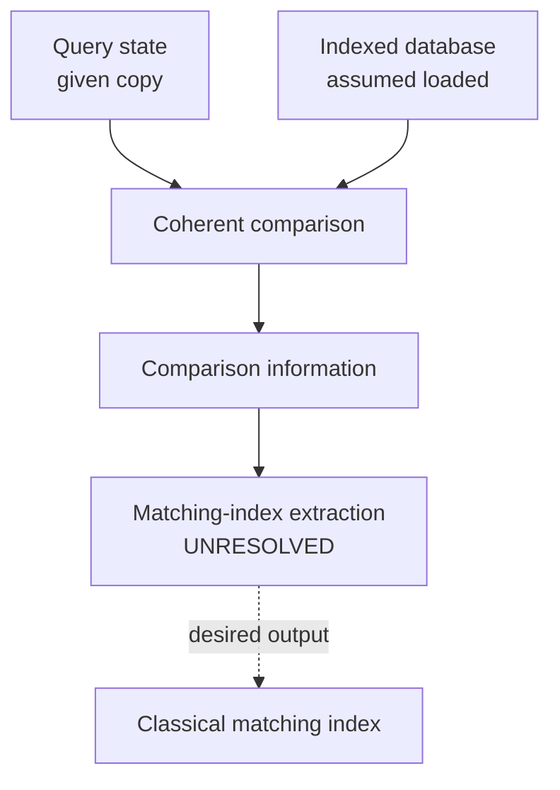

<!--
Original publication metadata (retained from the MDX source):
---
title: "How Do You Search When the Database Entries Are Not Perfectly Distinguishable?"
description: "A lookup problem where the query and stored items may overlap. Coherent comparison can provide a signal; extracting the matching index is the real trap."
date-display: "18th July 2021"
slug: "search-with-overlapping-items"
order: 3
difficulty: "Hard"
status: "Open-ended exploration"
changedAssumption: "Comparison is a physical operation instead of free equality"
source: "https://github.com/pafloxy/QuantumAlgorithmsCollect/blob/main/Algorithms/database_lookup_algorithm.ipynb"
draft: false
---
-->

# How Do You Search When the Database Entries Are Not Perfectly Distinguishable?

*A lookup problem where the query and stored items may overlap. Coherent comparison can provide a signal; extracting the matching index is the real trap.*

**18th July 2021** · **Hard** · **Open-ended exploration**

> **Changed assumption:** Comparison is a physical operation instead of free equality.

[Series index](README.md) · [Original notebook](https://github.com/pafloxy/QuantumAlgorithmsCollect/blob/main/Algorithms/database_lookup_algorithm.ipynb)

---

Ordinary database lookup is familiar:

```python
for i, item in enumerate(database):
    if item == query:
        return i
```

The interesting line is not the loop. It is `item == query`.

We usually treat equality as free. Now let the query and every database item be states that may overlap. One item may be an exact match while another is almost indistinguishable from it.

Can you compare all entries coherently and still recover the exact matching index?

```text
                         THE LOOKUP DESK

        QUERY                     STATE DATABASE
     +---------+                +----------------+
     |   phi   |                | 0 : psi_0      |
     +---------+                | 1 : psi_1      |
          \                     | 2 : psi_2      |
           \                    | 3 : psi_3      |
            \                   +----------------+
             \                         /
              +--------> (o_o) <-------+
                         /|\
                          |
                          v
                      index = ?

                    "Just use ==" is not a plan.
```

*These names label states for the reader; they are not classical descriptions supplied to the algorithm. The cabinet is a schematic, not a data-loading circuit.*

## A database of states

Let the query be $\ket{\phi}$ and the database contain

$$
\mathcal S=
\left\{
\ket{\psi_0},
\ket{\psi_1},
\ldots,
\ket{\psi_{N-1}}
\right\}.
$$

The entries need not be mutually orthogonal. Two different entries can therefore have a large overlap with the query.

For intuition, imagine:

```text
             OPENING EXAMPLE: SIMILARITY TO QUERY

index     fidelity     schematic bar
  0         0.80       [####################-----]
  1         0.93       [#######################--]
  2         1.00       [#########################]  exact match
  3         0.12       [###----------------------]

Bars are rounded. The printed numbers are the stated fidelities.
These are example data for the reader, not free oracle outputs.
```

The numbers represent $|\braket{\phi|\psi_i}|^2$. The task is to recover index `2` without assuming the states arrive with useful classical labels.

## The access model

To focus the puzzle, assume the database has already been loaded coherently. You receive a normalized state of the form

$$
\frac{1}{\sqrt N}
\sum_{i=0}^{N-1}\ket{\psi_i}\ket{i}
$$

and a copy of the query state $\ket{\phi}$.

This is a strong assumption. The puzzle does not hide or solve the data-loading cost. It asks what comparison-and-retrieval procedure follows after coherent indexed access is available.

```text
                  WHERE THE PUZZLE STARTS

DATA LOADING                GIVEN TO YOU              YOUR TASK
(not solved here)          coherent access

[ physical data ] ----> [ item + index registers ] ----> [ ????? ]
                            + query state                  |
                                                           v
                                                     classical index

               Access is assumed. Retrieval is not.
```

## The challenge

You are given:

- a query state $\ket{\phi}$;
- coherent indexed access to database states $\ket{\psi_i}$;
- no promise that the database states are mutually orthogonal.

Determine whether there is an index $i$ such that

$$
\ket{\psi_i}=\ket{\phi},
$$

and, if possible, recover that index.

You may coherently manipulate the query, item, index, and ancilla registers. You may not assume a free classical equality test for states.

Can you compare all candidates in a way that leaves enough usable information to retrieve the exact match?


## Why “compare all of them” is not enough

Quantum interference can compare a query against a coherent collection and make exact equality produce a sharp signature.

That sounds like the entire problem. It is not.

A comparison procedure may encode useful information across an index register without making the desired index easy to sample. A comparison signal and an index-retrieval procedure are different resources:

```text
        COMPARISON SIGNAL             INDEX RETRIEVAL

      "A useful pattern is            "The matching
       present in the state."          index is 2."
                  \                         /
                   \                       /
                    +----- NOT THE SAME ---+
```

The source notebook reaches this distinction and leaves the extraction step unresolved.



*The final dashed arrow is the missing step, not a claimed retrieval algorithm. The two inputs enter one joint operation; the drawing does not copy the query.*

## Detection is not retrieval

The same separation appears throughout algorithms. A procedure may cheaply tell you:

- that a constraint is violated;
- that some candidate is close;
- that a residual is zero;
- that a witness exists;
- that a special interference branch changed.

None of those facts automatically identifies the responsible object.

Here, the desired output is a classical index. The comparison acts coherently across many candidate indices. Turning that global signal into the exact index is the central challenge.

## One exact match and one near match

Take four entries and suppose

$$
\left|\braket{\phi|\psi_0}\right|^2=0.64,
\qquad
\left|\braket{\phi|\psi_1}\right|^2=0.92,
$$

$$
\left|\braket{\phi|\psi_2}\right|^2=1,
\qquad
\left|\braket{\phi|\psi_3}\right|^2=0.04.
$$

```text
             THIS SECTION'S FOUR-ENTRY EXAMPLE

index     fidelity          25-cell scale
  0         0.64            [################---------]
  1         0.92            [#######################--]  near
  2         1.00            [#########################]  exact
  3         0.04            [#------------------------]

                 near match: 0.92
                exact match: 1.00
                        gap: 0.08

          What guarantee will separate the two?
```

Index $2$ is the exact match. Index $1$ is close enough that finite statistical evidence may be difficult to distinguish from equality.

How should an exact lookup procedure treat that gap? What changes if nonmatching states can approach the query arbitrarily closely?

*A schematic precision trap—not a measurement protocol:*

```text
TRUE FIDELITY             ROUNDED TO TWO DECIMAL PLACES

  0.999999  ---------------------->  1.00   not exact
  1.000000  ---------------------->  1.00   exact
                                     ^
                                     |
                           same displayed number;
                           different lookup answers
```

## Constraints

For the clean version:

- the database contains $N$ indexed pure states;
- coherent indexed access is given;
- the query state is available;
- a unique exact match may be promised;
- nonmatching states may be arbitrarily close to the query;
- no classical descriptions or free equality oracle are given.

The no-match and multiple-match cases are useful extensions.

## Things to think about

1. If a comparison makes exact equality special, how can the index inherit that distinction?
2. Can the index register participate in a second interference or amplification step?
3. What changes when several entries are exact matches?
4. What should happen when there is no exact match but one fidelity is $0.999999$?

> **Claim boundary**
>
> The source notebook develops a coherent parallel-comparison idea, but explicitly leaves matching-index extraction unresolved. This page keeps that difficulty visible instead of presenting an unfinished sketch as a solved database-search algorithm. No search speedup or cheap data loading is claimed.

## Your move

The first surprise is that comparing every item at once is not the same as retrieving the right item.

What additional structure would turn the comparison signal into an index?

```text
                       THE MISSING BRIDGE

        +----------------------+       +------------------+
        | comparison recorded  |  ???  | matching index   |
        | in a quantum state   | ----> | read classically |
        +----------------------+       +------------------+

                  A signal is not yet an address.
```
