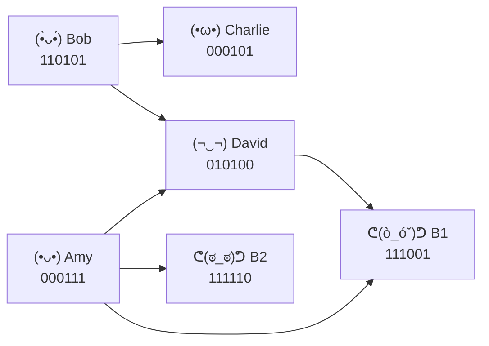
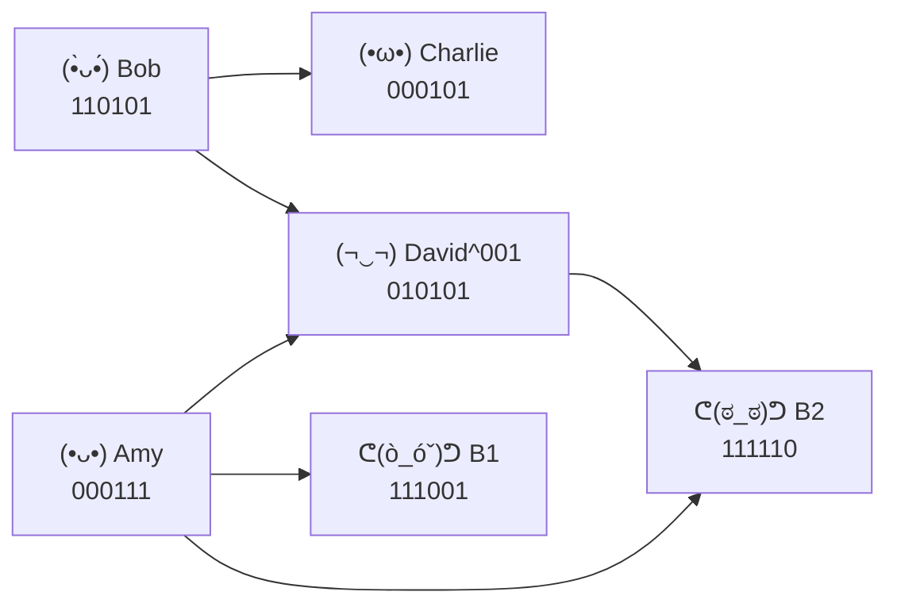
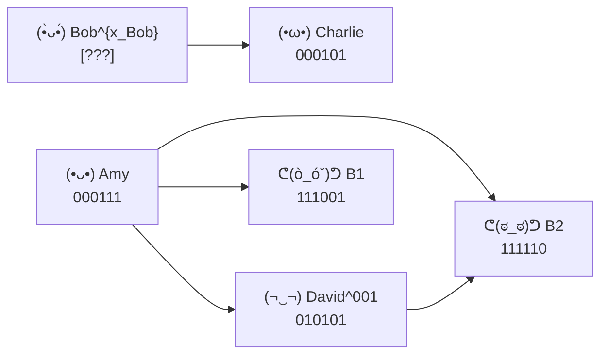

# How quantum computing helps you get into a nightclub.


In this blog I want to present a fun little algorithmic problem that arose in my own research while working on certain quantum error correction and quantum machine learning primitives. There is, however, going to be very little quantum computing in what follows, though it originated from one, sorry for the cheesy title --- had to get your attention --- but trust me it will be just as fun. 

I have deliberately **LeetCode-ized** the problem: I have thrown away almost all of the quantum and keep only the few "quantum"-derived primitives that the algorithm actually needs for being fun. There is one important difference from an actual LeetCode problem, though. (*ending a sentence with 'though' to copy Paul Graham, shy* :)

LeetCode usually hands you the right abstraction from the very beggining. Research problems generally do not have this courtesy, and finding one that 'actually' works is what an underpaid PhD student is left to do in a basement (*my office is literally in a basement* :/ ) Anyway I have done the work to save you from this misery.

Enough talk, let's head to our nightclub where things are little bit ... well unorthodox!

**Map of Content** 
- Most of the blog is about explaining you the problem that is concerned --- in a story like fashion, the main problem statement is only stated in the end 
- The blog ends with certain intuitive hints about how to end think about the problem, but does not provide a solution. I leave it as an exercise :)
- The main takeaway will be a lesson about how to think about commutation relation defined over a pair of bitstrings and how a graphical interpretation of commutation will be helpful. Though not immediate from this blog this fact has important consequences for quantum computing, which will be the content of a future blog :) 

**AI USAGE Note:** *The algorithmic content presented are generated by me who is human, (i.e I passed all Captcha tests), I used GPT-5.6 Terra for the drafting related tasks, the ASCII art generations etc. The ASCII art was GPT-5.6 Sol's idea --- said it looks more pro in world full of sloppy images --- and I agree xD --- though you'll need to expand the screen-width to make it visible.*


---

## Four friends, one suspiciously mathematical nightclub

Amy, Bob, Charlie, and David are standing in a queue to a nightclub. At one end of the queue is the club entrance. At the other end is a small badge shop.

For now the queue looks like this:

```text
              /\                                                                 ┌───────────┐
             /__\       (•ᴗ•)     (•̀ᴗ•́)      (•ω•)      (¬‿¬)                    │   CLUB    │
            | [] |       Amy        Bob        Charlie     David                 │  []   []  │
            |____|      000111     110101      000101    010100                  └─────┴┴────┘
          BADGE SHOP
```

David is closest to the club. Amy is closest to the badge shop.


Everyone carries an electronic badge on their phone. The badge contains nothing more mysterious than a 6 digit bit string:

| Person |       Badge Code   |
| ---------------- | -------- |
| Amy              | 000111 |
| Bob              | 110101 |
| Charlie          | 000101 |
| David            | 010100 |

The exact meaning of these bits does **not** matter :). What matters is that whenever for any two badge with codes $$A = a_1 ... a_6$$ and $$B = b_1 ... b_6$$ we can compute a function $f(A,B) \in \{0,1\}$, which is computed as follows : 

$$ f(A,B) = \left( \oplus_{i=1}^{3} a_ib_{2i+1} \right) \: \bigoplus \: \left( \oplus_{i=1}^{3} a_{2i+1}b_{i}  \right) $$ 

here $\oplus$ is addition modulo 2. Think of their phones flashing either 0 or 1, whenever they bring them close.

Let's call, $f(A,B) =0$ means the two badges are **compatible**; and $f(A,B)=1$ means the two badges **clash**. The function is symmetric, so 

$$f(A,B)=f(B,A)$$ 

and of course 

$$f(A,A)=0$$.


The mutual compatibility of all the badges of the four friends are as follows :

| f | **Amy**  | **Bob**  | **Charlie**  | **David**  |
| -------------------- | - | - | - | - |
| **Amy**              | 0 | 0 | 0 | 1 |
| **Bob**              | 0 | 0 | 1 | 1 |
| **Charlie**          | 0 | 1 | 0 | 0 |
| **David**            | 1 | 1 | 0 | 0 |

All of these badge codes and thus the compatibility function evaluations are public information: everybody can read everybody else's current code.


The club has the rule that :  **Two neighbouring people may exchange places only when their badges are compatible i.e f=0 for their badges.**


So Amy and Bob may swap, because their badges satisfy $$f(Amy,Bob)=0$$. Similarly Charlie and David may swap. But Bob and Charlie cannot cross one another, because $$f(Bob,Charlie)=1$$. The same is true of Bob and David.

So although everybody is standing in an ordinary-looking queue, not every permutation of the queue is reachable. For instance,

```text
(•ᴗ•)       (•̀ᴗ•́)       (•ω•)       (¬‿¬)
 Amy          Bob         Charlie      David
000111       110101       000101      010100
```

can become

```text
(•ᴗ•)       (•̀ᴗ•́)       (¬‿¬)       (•ω•)
 Amy          Bob          David      Charlie
000111       110101       010100      000101
```

because Charlie and David are compatible.

But David cannot simply keep walking left past Bob:

```text
(•ᴗ•)       (•̀ᴗ•́)   ✕   (¬‿¬)       (•ω•)
 Amy          Bob          David      Charlie
000111       110101       010100      000101
                  cannot cross
```

because $f(Bob,David)=1$. 

**Already the queue has acquired a little topology of its own :)**


## Two bouncers

Just like any nightclub, entering this club isn't  bouncer free. There are two, rather hunky, bouncers at the entrance of the club.

```text
              /\                                                                                   ┌───────────┐
             /__\       (•ᴗ•)     (•̀ᴗ•́)      (•ω•)      (¬‿¬)         ᕦ(ò_óˇ)ᕤ   ᕦ(ಠ_ಠ)ᕤ          │   CLUB    │
            | [] |       Amy        Bob        Charlie     David           B1          B2          │  []   []  │
            |____|      000111     110101      000101    010100         111001      111110         └─────┴┴────┘
          BADGE SHOP
```

They have scanners which also contain bit strings:

| Bouncer     |  Code          |
| --------- | -------- |
| Bouncer 1 | 111001 |
| Bouncer 2 | 111110 |

When someone reaches a bouncer, exactly the same function $f$ is computed between the bitstring on visitor's badge and the bouncer's code.

When
- $f=0$ means the visitor may cross that bouncer and get into the club :)
- $f=1$ means the visitor is stopped there (no matter how well he's dressed)

Ofcourse, a person gets into the club only after crossing **both** bouncers i.e $f$ must evaluate to zero between his badge and both the bouncers. 

For our four friends, the scanners currently report:

| Person | Bouncer 1  |  Bouncer 2 |
| ------------------------ | - | - |
| Amy                      | 1 | 1 |
| Bob                      | 0 | 0 |
| Charlie                  | 0 | 0 |
| David                    | 1 | 0 |

So Bob and Charlie have badges that both bouncers would accept. Amy would be rejected by both. David would pass the second bouncer but not the first.

At first this sounds like the whole problem is trivial: just look at this table and see who gets in. But a badge being accepted by the bouncers is not enough. The person first has to **reach them**.

Consider Bob. Both bouncers accept his badge. But David is standing in front of him, and $$f(Bob,David)=1$$. So Bob cannot simply overtake David. The fact that Bob's own badge passes both bouncers does not automatically give Bob a legal route to the entrance, poor Bob :/

This gives us two different ways to be blocked:

1. **directly:** your own badge clashes with a bouncer;
2. **indirectly:** your badge would pass the bouncers, but the queue contains somebody you are not allowed to cross.


The question : **“Will Bob get into the club?”**, is therefore not just a question about Bob and the bouncers. It is a question about the whole configuration.


## The badge shop

Fortunately, Amy, Bob, Charlie, and David are not stuck with their original badges. At the far end of the queue is the badge-modification shop:

```text
              /\                                                               ┌───────────┐
             /__\       (•ᴗ•)     (•̀ᴗ•́)      (•ω•)      (¬‿¬)                  │   CLUB    │
            | [] |       Amy        Bob        Charlie     David               │  []   []  │
            |____|      000111     110101      000101    010100  → BOUNCERS →  └─────┴┴────┘
          BADGE SHOP                                                           
```

The shop contains three bitmask codes:

| Bitmask |  Code         |
| ------------ | -------- |
| BitMask 1       | 000100 |
| BitMask 2       | 000010 |
| BitMask 3       | 000001 |

These are not replacement badges. Think of them as binary overlays that can be added to the code already on someone's badge. 

The same compatibility function $f$ is defined for the bitmask codes as well. In particular, the three primitive bitmasks are mutually compatible:

$$
f(\mathrm{BitMask}\ i,\mathrm{BitMask}\ j)=0
$$ for every pair $i,j$.

So the shop may freely combine several primitive bitmasks into one bitmask. Let,
$$
x=x_1x_2x_3\in\{0,1\}^3
$$ record which primitive bitmasks are selected, and write their combined code as

$$
S(x)
=
x_1 \cdot \,\mathrm{BitMask\ 1}
\: \oplus \:
x_2 \cdot \,\mathrm{BitMask\ 2}
\: \oplus \:
x_3 \cdot \,\mathrm{BitMask\ 3}.
$$

For example, $x=101$ means that BitMasks 1 and 3 are selected. If somebody currently carries badge $A$, then whenever the chosen bitmask $S(x)$ is compatible with the badge $A$ i.e $f(A, S(x))=0$, we can legally applicable we write the rewritten badge as 

$$
A^x:=A\oplus S(x).
$$

For instance,

```text
A       : 000111
S(101)  : 000101
          ------
A^101   : 000010
```


The useful part is that the rewrite changes compatibility predictably, for any bitstring $R$ the compatibility of the initial bitstring $A$ and the rewritten bitstring $A^x$ is given by :

$$
f(A^x,R)=f(A,R)\oplus f(S(x),R).
$$ 

i.e the compatibility with the rewritten bitstring $A^x$ with $R$ is the XOR of the compatibility of the initial bitstring $A$ with $R$ and the compatibility of the selected bitmask $S(x)$ with $R$. 


Note that since compatability is defined on our current bitstrings, rewriting it can alter the compatibility of that person both with the other people in the queue and with the bouncers. The motive to "rewrite" your badge is ofcourse to be able to enter the nightclub. This is possible since once a badge is rewritten your compatibility with everyone else in the queue as well as the bouncers change, so maybe you will have a better luck. 


There is however a catch though. 

<!--
SPLICE POINT

Insert this immediately after the existing sentence:

"There is however a catch though."

Everything before that sentence in the current blog draft is intended to remain unchanged.
-->

### The catch: the shop does not teleport masks

The shop can build useful badge modifications. But it cannot magically apply them to somebody standing halfway down the queue. Instead, whenever somebody wants their badge rewritten, two things need to happen : 

First, **the person needs to move as close as possible to the badge shop as allowed by the compatibility allows**. Once there he can call the badge shop and let them know the bitmask $S(x)$ he want for the rewrite. Then a courier from the shop loads the chosen bitmask $S(x)$ code onto their phone and walks toward that person. The courier too has to follow the same compatibility rule as everybody else:  **The courier may cross somebody only when the bitmask code they are carrying is compatible with that person's badge.** So a rewrite is not just about finding a clever bitmask. We also have to be able to **delivered** to the person who wants the rewrite. 


Let us see what that means with one concrete example.

### David wants his badge rewritten

Recall the hierarchy: 

```text
              /\
             /__\       (•ᴗ•)     (•̀ᴗ•́)      (•ω•)      (¬‿¬)
            | [] |       Amy        Bob        Charlie     David
BADGE SHOP  |____|      000111     110101      000101    010100       → BOUNCERS → ┌─────┐ CLUB └─────┘
```

Suppose David wants a new badge. Before the shop does anything, David first walks backward toward it as far as he can.

David is compatible with Charlie, so they may swap:

```text
              /\                                                               ┌───────────┐
             /__\       (•ᴗ•)     (•̀ᴗ•́)   ✕   (¬‿¬)      (•ω•)                 │   CLUB    │
            | [] |       Amy        Bob          David      Charlie            │  []   []  │
            |____|      000111     110101       010100     000101 → BOUNCERS → └─────┴┴────┘
          BADGE SHOP                                                           
```

But now David meets Bob. Their badges clash: $f(\mathrm{David},\mathrm{Bob})=1.$ So David cannot get any closer to the shop. This is as far backward as the ordinary swapping rules can move him. That is important. Amy and Bob are now the people that remain unavoidably between the shop and David. Charlie was not unavoidable: David could simply move past him. Now the shop chooses a bitmask and sends the courier.


Suppose David orders the **S(100) = BitMask 1**:

```text
BitMask 1 : 000100
```

The courier starts at the shop:

```text
              /\
             /__\      ᕕ( ᐛ )ᕗ       (•ᴗ•)        (•̀ᴗ•́)        (¬‿¬)        (•ω•)
            | [] |       COURIER       Amy           Bob          David       Charlie
            |____|       [000100]     000111        110101       010100      000101
          BADGE SHOP         ───────────►
```

The bitmask is compatible with Amy, so the courier can cross Amy. But it clashes with Bob. So the courier gets stuck:

```text
              /\
             /__\        (•ᴗ•)       ᕕ( ᐛ )ᕗ  ✕  (•̀ᴗ•́)       (¬‿¬)
            | [] |        Amy          COURIER         Bob         David
            |____|       000111        [000100]       110101      010100
          BADGE SHOP                      stuck
```

The bitmask might have been extremely useful *if it could reach David*. That does not matter. It cannot be delivered.

Now try **S(001) = BitMask 3** instead:

```text
BitMask 3 : 000001
```

```text
              /\
             /__\      ᕕ( ᐛ )ᕗ    ✓   (•ᴗ•)    ✓   (•̀ᴗ•́)    ✓   (¬‿¬)
            | [] |       COURIER        Amy           Bob          David
            |____|       [000001]      000111        110101       010100
          BADGE SHOP         ───────────────────────────────────────►
```

This one is compatible with Amy. It is also compatible with Bob. So the courier can pass both of them and reach David. There is one final check:, recall that the chosen bitmask must also be compatible with David's own current badge before it can be attached. BitMask 3 passes that check too. So this modification is legal. The shop has successfully delivered a rewrite to somebody who never reached the shop. That is the rule we will use from now on.


### Summary of the delivery rule

For a target with badge $A$:

1. **Move the target toward the shop** as far as legal swaps allow.
2. **Deliver the chosen bit mask** $S(x)$ through everyone still between the shop and the target. For each such badge $Q$, require $$f(S(x),Q)=0$$.
3. **Attach the bit mask** only if $f(S(x),A)=0$, and then rewrite $A\longmapsto A^x=A\oplus S(x).$

The target itself need not cross the people that remain before it; the **bit mask** must. 


### David's legal rewrite still does not solve his problem

The courier has successfully delivered **BitMask 3** to David, and the bit mask is compatible with David's badge, so the rewrite is legal. But David is not at the club entrance yet.

After moving toward the badge shop earlier, the queue is

```text
              /\                                                                 ┌───────────┐
             /__\       (•ᴗ•)     (•̀ᴗ•́)      (¬‿¬)        (•ω•)                  │   CLUB    │
            | [] |       Amy        Bob        David^001     Charlie             │  []   []  │
            |____|      000111     110101       010101       000101 → BOUNCERS → └─────┴┴────┘
          BADGE SHOP                                                           
```

So David must still move past Charlie before he can reach the bouncers. Originally David and Charlie were compatible, and BitMask 3 is also compatible with Charlie. Therefore the rewrite does not change that relation:

$$
f(\mathrm{David}^{001},\mathrm{Charlie})
=
f(\mathrm{David},\mathrm{Charlie})
\oplus
f(\mathrm{BitMask\ 3},\mathrm{Charlie})
=
0\oplus0
=
0.
$$

So David can still cross Charlie and reach the bouncers. Now look at what the rewrite actually did to his bouncer checks.

Before the rewrite, David's bouncer signature was


```text  
| f          | Bouncer 1 | Bouncer 2 |
|-----------:|:---------:|:---------:|
| David      |     1     |     0     |
```

so only Bouncer 1 stopped him.

BitMask 3 has signature


```text  
| f          | Bouncer 1 | Bouncer 2 |
|-----------|:---------:|:---------:|
| BitMask 3 |     1     |     1     |
```


and the compatibility bits update by XOR. Hence David's rewritten badge has signature

```text
David before :  (1,0)    B1 ✕   B2 ✓
BitMask 3    :  (1,1)
                 -----
David^001    :  (0,1)    B1 ✓   B2 ✕
```

So the rewrite removes David's clash with Bouncer 1, but creates a clash with Bouncer 2. So unfortunately, though David can reach the entrance with a rewritten badge, he still cannot enter the club. The rewrite was therefore **legal but not useful**: it did not remove David's obstruction; it merely moved it from one bouncer to the other.


##  The challenge

Let us now freeze the problem, By collecting all the information I shared :

- the initial queue of four friends and the bitstrings on their badge 

```text
(•ᴗ•)       (•̀ᴗ•́)       (•ω•)       (¬‿¬)
 Amy          Bob         Charlie      David
000111       110101       000101      010100
```

- the two bouncers and the bitstrings on their scanners 

```text
ᕦ(ò_óˇ)ᕤ          ᕦ(ಠ_ಠ)ᕤ
   B1                 B2
 111001             111110
```


- the three primitive bitmask codes;

```text
| Bitmask |  Code         |
| ------------ | -------- |
| BitMask 1       | `000100` |
| BitMask 2       | `000010` |
| BitMask 3       | `000001` |
```

- the compatibility function $f(P,Q)$ for every pair of bit strings; and the rule that compatible neighboring people may swap;

```text
A  ⇄  B        only when f(A,B)=0
```


- the rule that somebody crosses a bouncer only when their badge is compatible with it;

```text
                              .-----------.
person -- f=0 --> bouncer --> |   CLUB    |
                              |  []   []  |
person -- f=1 -X-> bouncer    '-----------'
```

- the rule that a target first moves toward the badge shop as far as compatibile swaps allow;

```text
      /\
     /__\   ◄──────── target
    | [] |      swap left while f=0
    |____|
  BADGE SHOP
```

- the rule that the courier must be able to carry the chosen bitmask through everybody still unavoidably before that target;

```text
      /\
     /__\
    | [] |
    |____|
  BADGE SHOP
      |
      v
   ᕕ( ᐛ )ᕗ
    COURIER
     [S(x)]
      |
      v
     Q1  ──✓──  Q2  ──✓──  ...  ──✓──  Qk  ─────►  TARGET
    [•••]      [•••]                  [•••]          [ A ]
     f=0        f=0                    f=0

The bit mask must be compatible with
every unavoidable person before the target.
```
- the rule that the bitmask must be compatible with the target itself $f(S(x), A)=0$; and the rewrite rule : $A^x= A\oplus S(x).$


All badge strings are public. When a rewrite happens, everybody immediately knows the new badge code for everyone else.There is no hidden-information game here.

Given all of this, sorry it was too long a story, Your task is:

> **Find an efficient algorithm for rewriting badges so that as many people as possible can enter the nightclub. Efficient here meaning that it better not just brute-force try all possibilities, that's not even an algorithm. Or be a peesimist (which is another word for a complexity theorist) and prove that such an algorithm must not exist.**


>The algorithm should be able to answer:
>
> - Who finally got to enter the club  ?
> - Who could not get enter the club, no matter what ? 
> - And what sequence of rewriting (i.e the choice of the bitmask + the person who orders it) leads to the solution. 


## A more General version for the nerds 

If you are wondering, here is a more general version that is more closer to the version I had to deal with


```text
                 GENERAL VERSION
                 ---------------


        BIT-MASK SHOP            PEOPLE-QUEUE                        BOUNCERS
      ┌───────────────┐        P_1    P_2    ···    P_t         D1   D2   ···   D_r
      │S_1 S_2 .. S_k │        [n]     [n]          [n]         [n]  [n]        [n]
      └───────────────┘

      (k) mutually compatible      (t) 2n-bit badges            (r) 2n-bit strings
      2n-bit bit-masks
```


---


## How to solve it ?

Now even though I'll not give you the answer, I will give you a hint, which I am sure the smart ones amongst you have already have figured.

The first thing to notice is that most details of the literal queue are actually irrelevant. You can capture most of the Data structure using something called a **Directed Acyclic Graph (DAG)**. 
- Think of each person, both those in the queue as well as the bouncers as a vertex in a graph,
- Draw an edge between the vertices when the compatibility function $f$ evaluates to $f=1$ between their bitstrings   
  - So there will be edges between clubbers to clubbers 
  - from the clubbers to bouncers 
  - but ignore the edges between bouncers to bouncers (they won't be necessary) 
- Add a direction to the edges by taking the order specified by the people standing in the queue.  


The DAG-ification of the initial configuration is as follows:




A person gets to enter the club if and only if there is no *directed path* connecting his vertex to either vertices of the bouncers. Which in graph-theoretic terms is captured by *graph reachability*, i.e a person can enter the club if and only if a vertex corresponding to a bouncer is not reachable from the vertex corresponding to his own. For instance here Charlie can easily enter the club. But Bob can't just snuck in right after Charlie however, since he's blocked by David, who himself blocked by a bouncer. 


You can also see that some of the rewrite rules also become easier to interpret. For example, the fact what the courier can reach the to a certain person $A$ only requires the chosen bitmask $S(x)$ to be compatible to the badges of the people who's vertex can reach $A$'s vertex. 

Note that, once the rewrite happens however, the DAG needs to be redrawn, based on the new compatability. But given the above formula for computing updates of the compatability 

$$f(A^x,R)=f(A,R)\oplus f(S(x),R).$$ 

you can already compute how the edges in the DAG needs to be rewritten due to the choice of the rewrite $S(x)$. Which is great, because using the results in converse you can ask what choice of $S(x)$ will modify the DAG in a way that we want, given ofcourse that the rewrite is legal. 


For instance when David rewrites his badge using $S(001)$ and his badge changes from $$S(x) \cdot 010100 \: \to \: 010101$$, the corresponding DAG changes to:


Here you can see how David's new obstruction is encoded into the new DAG structure, but using the formula for computing the update to the bitstring you could have predicted it already, and see that it does not allow him to get to the Club. :)

**So the problem statement in DAG terms:** 

>  **Find an algorithm to rewrite the badges such that, from the vertices corresponding the people in the queue the vertices corresponding to the bouncers are not reachable.**


A direction to think of would be to see if you can derive a set of conditions on the $S(x)$ given the topology of the DAG such that doing a single rewrite already makes their corresponding vertex have no reachable path to that of a bouncer. For instance, if Bob can find a rewrite $$S(x_{\mathrm{Bob}})$$ that will remove the directed edge from his vertex to David and also not introduce any other new edges to another person in the queue or a bouncer, as shown 



he can simply snuck in to the club behind Charlie. 

So all you need to do is have an efficient algorithm that will allow you to identify such an $S(x_{\mathrm{Bob}})$. However a wrong rewrite can as well introduce new edges that weren't there before, so you better be careful :) 


**Unfortunately, that as much as I can hint you, if you manage to find a solution then you can make a PR to this repo highlighting this file, I will make sure to reject it ;). Happy problem solving !**

